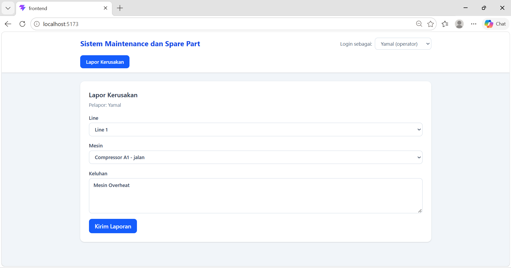
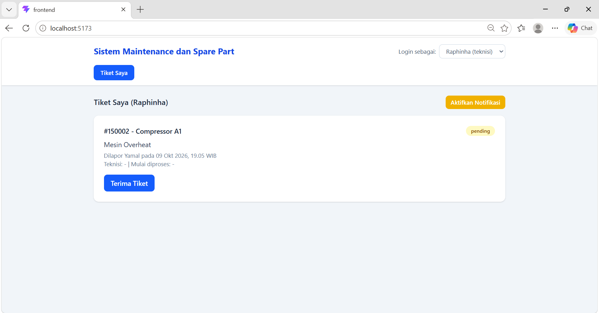
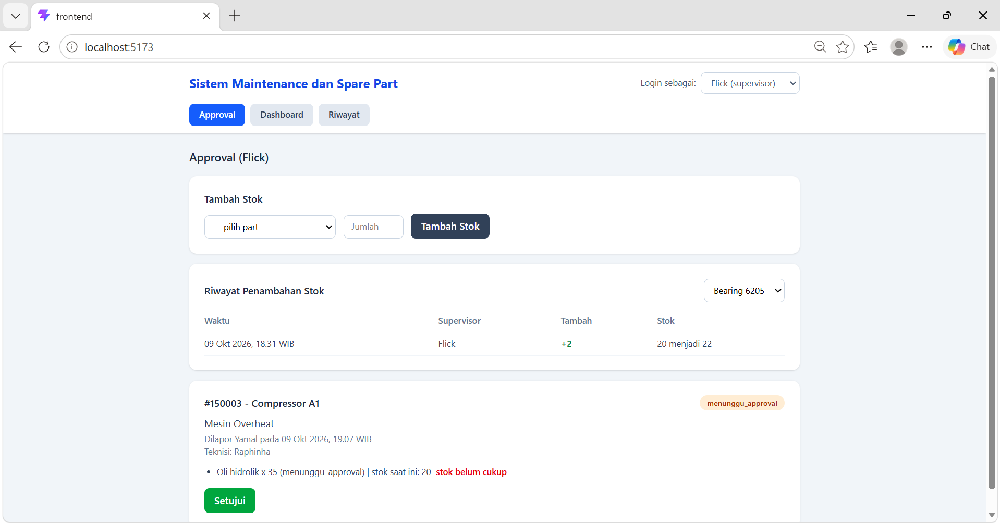
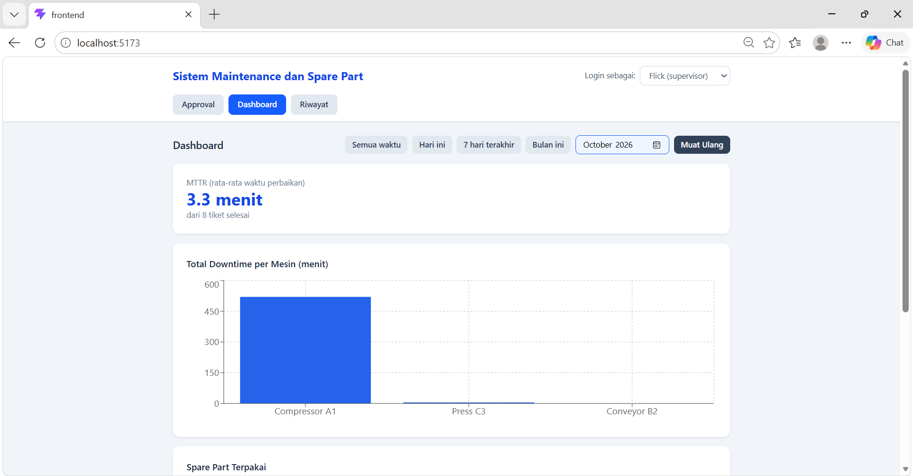
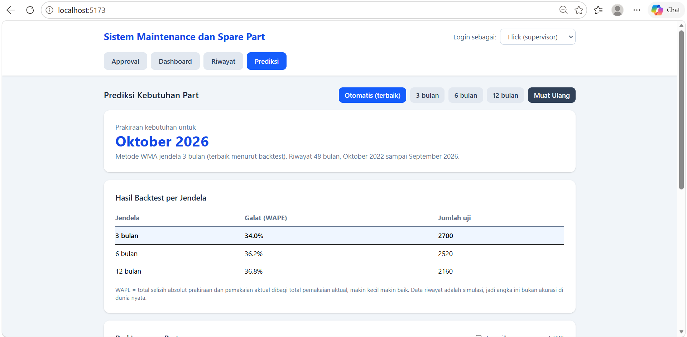
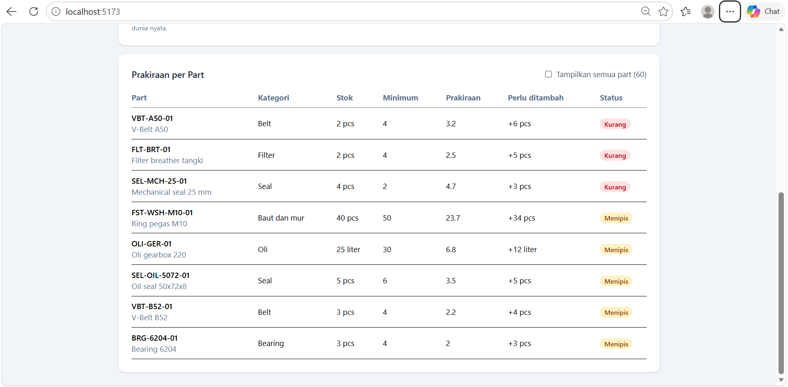
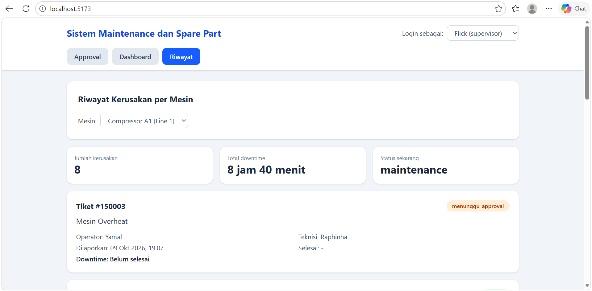

# Sistem Maintenance dan Spare Part

Aplikasi web untuk mengelola tiket kerusakan mesin produksi dan stok spare part. Operator melapor kerusakan, teknisi memperbaiki dan memakai spare part, supervisor menyetujui pemakaian part dan memantau dashboard downtime.

Proyek ini saya bangun berdasarkan pengalaman PKL di bagian Maintenance PT TD Automotive Compressor Indonesia (2019), jadi alurnya mengikuti cara kerja spare part dan perbaikan mesin di lapangan.

## Screenshot

| Lapor kerusakan (operator) | Tiket saya (teknisi) |
|---|---|
|  |  |

| Approval dan riwayat stok (supervisor) | Dashboard (supervisor) |
|---|---|
|  |  |

| Prediksi kebutuhan part (supervisor) | Prediksi per part |
|---|---|
|  |  |



## Fitur

**Semua peran**
- Login dengan email dan password. Setiap peran hanya melihat menu miliknya, dan API menolak akses lintas peran.

**Operator**
- Melapor kerusakan mesin beserta keluhan.

**Teknisi**
- Menerima tiket, memakai spare part pada tiket, dan menyelesaikan perbaikan.
- Notifikasi tiket baru lewat polling (8 detik), bunyi beep, dan Notification API browser.

**Supervisor**
- Menyetujui pemakaian part saat stok tidak cukup.
- Menambah stok spare part, lengkap dengan riwayat penambahan stok per part.
- Mencari part berdasarkan nomor part atau kategori saat memilih part.
- Dashboard: total downtime per mesin, spare part paling sering dipakai, MTTR (rata-rata waktu perbaikan), dan peringatan stok menipis. Bisa difilter per periode (semua waktu, hari ini, 7 hari terakhir, bulan ini) atau per bulan.
- Riwayat kerusakan per mesin beserta part yang dipakai dan lama downtime.
- Prediksi kebutuhan spare part dengan metode Weighted Moving Average (WMA): backtest otomatis membandingkan jendela 3, 6, dan 12 bulan dan memilih yang galatnya (WAPE) terkecil, lalu memperkirakan kebutuhan bulan berjalan dan status tiap part (aman, menipis, kurang).

## Alur tiket

```
pending -> diproses -> selesai
              |
              +-> menunggu_approval (stok part kurang) -> disetujui supervisor -> lanjut
```

Pemakaian part dan penambahan stok memakai transaksi database dengan penguncian baris (`SELECT ... FOR UPDATE`), sehingga dua permintaan bersamaan tidak membuat stok bernilai salah. Tiket tidak dihapus saat selesai, hanya statusnya yang berubah, supaya riwayat dan laporan tetap utuh.

## Autentikasi

- Login memakai email dan password. Password disimpan sebagai hash bcrypt (salt rounds 10).
- Server mengeluarkan satu JWT dengan masa berlaku 8 jam. Isinya `{id, nama, role}`, ditandatangani dengan `JWT_SECRET` dari `backend/.env`.
- Token dikirim lewat header `Authorization: Bearer <token>`. Frontend menyimpannya di `localStorage`, dan logout berarti menghapus token di browser.
- Identitas pengguna (operator, teknisi, supervisor) selalu diambil dari token, bukan dari body request, sehingga tidak bisa dipalsukan dari sisi klien.
- Role dicek di server: operator hanya boleh melapor, teknisi mengelola tiket dan memakai part, supervisor menyetujui dan menambah stok.

## Teknologi

- Frontend: React 19, Vite 8, TypeScript, Tailwind CSS 4, Recharts
- Backend: Node.js, Express, mysql2, bcrypt, jsonwebtoken
- Database: MySQL-compatible (dikembangkan di TiDB Cloud Starter)

## Arsitektur

```
Frontend (React, port 5173) ---> Backend API (Express, port 5001) ---> Database MySQL
```

## Struktur folder

```
maintenance-system/
|-- backend/    API Express (src/routes per entitas, src/middleware untuk auth)
|-- frontend/   Aplikasi React + TypeScript
|-- database/   schema.sql dan seed.sql
`-- docs/       screenshot
```

## Cara menjalankan

Butuh Node.js dan sebuah database MySQL-compatible yang kosong.

1. Buat tabel dan data contoh: jalankan isi `database/schema.sql`, lalu `database/seed.sql` (cukup sekali) pada database tersebut.
2. Backend:
```
   cd backend
   copy .env.example .env
   npm install
```
   Isi `backend/.env` dengan data koneksi database Anda dan `JWT_SECRET` (string acak yang panjang). Contoh membuatnya:
```
   node -e "console.log(require('crypto').randomBytes(32).toString('hex'))"
```
   Lalu jalankan:
```
   npm run dev
```
   Backend berjalan di `http://localhost:5001`.
3. Frontend (terminal lain):
```
   cd frontend
   npm install
   npm run dev
```
   Buka `http://localhost:5173`.

Data contoh: 3 pengguna, 3 mesin, dan 3 spare part.

## Akun demo

Akun berikut ada di `database/seed.sql` dan hanya untuk demo:

| Peran | Email | Password |
|---|---|---|
| Operator (Yamal) | yamal@operator.com | Operator#2026 |
| Teknisi (Raphinha) | raphinha@teknisi.com | Teknisi#2026 |
| Supervisor (Flick) | flick@supervisor.com | Supervisor#2026 |

## Endpoint API

Semua endpoint selain `POST /auth/login` membutuhkan token JWT. Kolom "Peran" menunjukkan siapa yang boleh memanggil; "Semua" berarti peran apa pun yang sudah login.

| Method | Endpoint | Peran | Fungsi |
|---|---|---|---|
| POST | `/auth/login` | Publik | Login, mengembalikan `{token, user}` |
| GET | `/mesin` | Semua | Daftar mesin |
| GET | `/mesin/:id/riwayat` | Semua | Riwayat tiket mesin, part yang dipakai, dan lama downtime |
| GET | `/users` | Semua | Daftar pengguna |
| GET | `/spare-parts` | Semua | Daftar spare part (nomor part, kategori, stok) |
| POST | `/spare-parts/:id/stok` | Supervisor | Tambah stok |
| GET | `/spare-parts/:id/riwayat` | Semua | Riwayat penambahan stok part |
| GET | `/tiket` | Semua | Daftar tiket (`?status=aktif` untuk yang belum selesai) |
| GET | `/tiket/:id` | Semua | Detail tiket beserta part |
| POST | `/tiket` | Operator | Melapor kerusakan |
| PATCH | `/tiket/:id/terima` | Teknisi | Menerima tiket |
| POST | `/tiket/:id/part` | Teknisi | Menambahkan part ke tiket |
| PATCH | `/tiket/:id/setujui` | Supervisor | Menyetujui part |
| PATCH | `/tiket/:id/lanjut` | Teknisi | Melanjutkan setelah stok cukup |
| PATCH | `/tiket/:id/selesai` | Teknisi | Menyelesaikan tiket |
| GET | `/dashboard/downtime` | Semua | Total downtime per mesin |
| GET | `/dashboard/part-terpakai` | Semua | Spare part paling sering dipakai |
| GET | `/dashboard/mttr` | Semua | MTTR dan jumlah tiket selesai |
| GET | `/dashboard/stok-menipis` | Semua | Part dengan stok di bawah minimum |
| GET | `/prediksi/part` | Semua | Prakiraan kebutuhan tiap part untuk bulan berjalan dengan WMA dan backtest (`?jendela=3\|6\|12`) |

Endpoint downtime, part-terpakai, dan mttr menerima `?periode=semua|hari|minggu|bulan` atau `?bulan=TTTT-BB` (misalnya `2026-10`). Jika keduanya dikirim, `bulan` yang dipakai. Semua error dikembalikan sebagai `{ "error": "..." }`: 401 untuk token tidak ada atau tidak valid, 403 untuk peran yang tidak diizinkan.

## Keterbatasan

- Autentikasi sengaja dibuat sederhana: satu JWT 8 jam tanpa refresh token, tanpa halaman daftar akun, dan tanpa reset password. Logout hanya menghapus token di browser (token tidak di-blacklist di server).
- Notifikasi hanya lewat polling, beep, dan Notification API. Notifikasi ke Telegram atau WhatsApp menjadi rencana pengembangan.
- Backend belum di-hosting, jadi belum ada link demo.
- Data di database adalah data uji, termasuk riwayat tiket 4 tahun yang dipakai pada fitur prediksi. Galat WAPE pada backtest hanya mengukur seberapa cocok WMA dengan pola data simulasi tersebut, bukan akurasi prediksi pada kondisi nyata.

## Rencana pengembangan

- Jadwal preventive maintenance dengan pengingat otomatis.
- Refresh token, halaman manajemen akun, dan reset password.