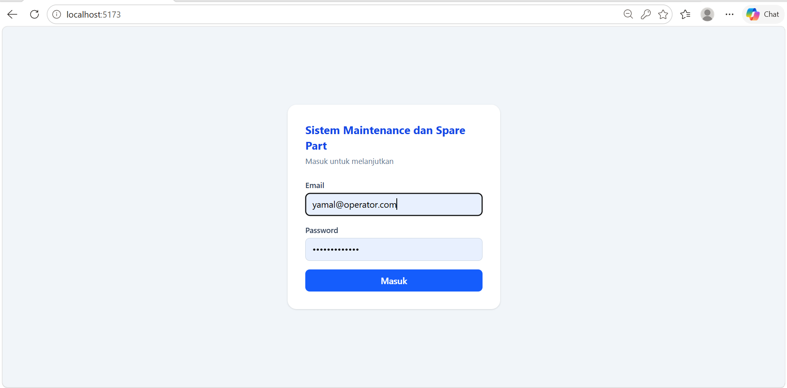

# Sistem Maintenance dan Spare Part

Aplikasi web untuk mengelola tiket kerusakan mesin produksi dan stok spare part. Operator melaporkan kerusakan, teknisi menangani perbaikan dan penggunaan spare part, sedangkan supervisor menyetujui penggunaan part serta memantau dashboard downtime dan stok.

Proyek ini dikembangkan berdasarkan pengalaman PKL di bagian Maintenance PT TD Automotive Compressor Indonesia (2019), sehingga alur aplikasi disesuaikan dengan proses pengelolaan spare part dan perbaikan mesin di lapangan.

## Screenshot

### 1. Login

| Halaman Login |
|---|
|  |

### 2. Operator

| Lapor Kerusakan |
|---|
|  |

### 3. Teknisi

| Tiket Saya |
|---|
|  |

### 4. Supervisor

| Approval dan Riwayat Stok | Dashboard |
|---|---|
|  |  |

| Riwayat Kerusakan per Mesin | Prediksi Kebutuhan Part |
|---|---|
|  |  |

| Prediksi per Part |
|---|
|  |

## Fitur

### Semua Peran
- Login menggunakan email dan password.
- Pembatasan akses berdasarkan peran pengguna.
- API memvalidasi hak akses agar pengguna tidak dapat menjalankan tindakan di luar kewenangannya.

### Operator
- Melaporkan kerusakan mesin beserta keluhan.

### Teknisi
- Menerima tiket kerusakan.
- Menambahkan spare part yang digunakan dalam perbaikan.
- Menyelesaikan tiket setelah perbaikan selesai.
- Menerima notifikasi tiket baru melalui polling setiap 6 detik, bunyi beep, dan Notification API browser.

### Supervisor
- Menyetujui permintaan penggunaan spare part ketika stok tidak mencukupi.
- Menambah stok spare part dan melihat riwayat penambahan stok setiap part.
- Mencari spare part berdasarkan nomor part atau kategori.
- Memantau total downtime per mesin.
- Melihat spare part yang paling sering digunakan.
- Memantau MTTR (*Mean Time to Repair*), yaitu rata-rata waktu perbaikan.
- Melihat peringatan stok menipis.
- Memfilter dashboard berdasarkan periode atau bulan tertentu.
- Melihat riwayat kerusakan setiap mesin, spare part yang digunakan, dan lama downtime.
- Memperkirakan kebutuhan spare part menggunakan metode Weighted Moving Average (WMA).

Fitur prediksi membandingkan jendela historis 3, 6, dan 12 bulan melalui backtesting, kemudian memilih jendela dengan nilai WAPE terkecil untuk menghasilkan estimasi kebutuhan part dan status stok.

## Alur Tiket

Alur utama tiket perbaikan:

```text
pending -> diproses -> selesai
               |
               +-> menunggu_approval
                    (stok part kurang)
                         |
                         v
                 disetujui supervisor
                         |
                         v
                  teknisi melanjutkan
```

Pemakaian part dan penambahan stok menggunakan transaksi database dengan penguncian baris melalui `SELECT ... FOR UPDATE`. Mekanisme ini membantu menjaga konsistensi stok ketika beberapa permintaan diproses secara bersamaan.

Tiket yang selesai tidak dihapus, melainkan diubah statusnya agar riwayat dan laporan tetap tersedia.

## Autentikasi dan Otorisasi

- Password disimpan dalam bentuk hash menggunakan bcrypt dengan salt rounds 10.
- Server menerbitkan JWT (*JSON Web Token*) dengan masa berlaku 8 jam.
- Token memuat identitas pengguna berupa `id`, `nama`, dan `role`.
- JWT ditandatangani menggunakan `JWT_SECRET` yang disimpan dalam `backend/.env`.
- Token dikirim melalui header `Authorization: Bearer <token>`.
- Frontend menyimpan token di `sessionStorage`.
- Identitas dan peran pengguna diambil dari token yang diverifikasi server, bukan dipercaya dari body request.
- Hak akses diperiksa di backend berdasarkan peran operator, teknisi, dan supervisor.

## Teknologi

| Bagian | Teknologi |
|---|---|
| Frontend | React 19, Vite 8, TypeScript, Tailwind CSS 4, Recharts |
| Backend | Node.js, Express |
| Database Driver | mysql2 |
| Database | MySQL-compatible, dikembangkan menggunakan TiDB Cloud Starter |
| Autentikasi | JWT dan bcrypt |

## Arsitektur

```text
Frontend (React, port 5173)
            |
            v
Backend API (Express, port 5001)
            |
            v
Database MySQL-compatible
```

## Struktur Folder

```text
maintenance-system/
├── backend/       API Express, routes, dan middleware
├── frontend/      Aplikasi React + TypeScript
├── database/      schema.sql dan seed.sql
└── docs/
    └── screenshots/
```

## Cara Menjalankan

### Persyaratan

- Node.js dan npm.
- Database MySQL-compatible yang sudah dibuat dan dapat diakses.

### 1. Siapkan Database

Jalankan file SQL berikut secara berurutan pada database yang digunakan:

1. `database/schema.sql`
2. `database/seed.sql`

Seed berisi data contoh untuk pengujian aplikasi.

### 2. Jalankan Backend

Buka terminal di folder proyek:

```bat
cd backend
copy .env.example .env
npm install
```

Isi `backend/.env` dengan konfigurasi koneksi database dan `JWT_SECRET` milik sendiri.

Untuk membuat secret acak, jalankan:

```bat
node -e "console.log(require('crypto').randomBytes(32).toString('hex'))"
```

Kemudian jalankan backend:

```bat
npm run dev
```

Backend berjalan di `http://localhost:5001`.

### 3. Jalankan Frontend

Buka terminal baru dari folder utama proyek:

```bat
cd frontend
npm install
npm run dev
```

Buka aplikasi melalui:

`http://localhost:5173`

## Akun Demo

Akun berikut digunakan untuk pengujian lokal dan tersedia pada `database/seed.sql`.

| Peran | Email | Password |
|---|---|---|
| Operator | `yamal@operator.com` | `Operator#2026` |
| Teknisi | `raphinha@teknisi.com` | `Teknisi#2026` |
| Supervisor | `flick@supervisor.com` | `Supervisor#2026` |

**Catatan:** Akun tersebut hanya untuk demo. Jangan gunakan password demo untuk akun produksi.

## Endpoint API

Semua endpoint selain `POST /auth/login` membutuhkan JWT yang valid.

| Method | Endpoint | Hak Akses | Fungsi |
|---|---|---|---|
| POST | `/auth/login` | Publik | Login dan memperoleh token |
| GET | `/mesin` | Semua | Mendapatkan daftar mesin |
| GET | `/mesin/:id/riwayat` | Semua | Melihat riwayat tiket mesin |
| GET | `/users` | Semua | Mendapatkan daftar pengguna |
| GET | `/spare-parts` | Semua | Mendapatkan daftar spare part |
| POST | `/spare-parts/:id/stok` | Supervisor | Menambah stok spare part |
| GET | `/spare-parts/:id/riwayat` | Semua | Melihat riwayat penambahan stok |
| GET | `/tiket` | Semua | Mendapatkan daftar tiket |
| GET | `/tiket/:id` | Semua | Melihat detail tiket dan part |
| POST | `/tiket` | Operator | Melaporkan kerusakan |
| PATCH | `/tiket/:id/terima` | Teknisi | Menerima tiket |
| POST | `/tiket/:id/part` | Teknisi | Menambahkan part ke tiket |
| PATCH | `/tiket/:id/setujui` | Supervisor | Menyetujui penggunaan part |
| PATCH | `/tiket/:id/lanjut` | Teknisi | Melanjutkan proses perbaikan |
| PATCH | `/tiket/:id/selesai` | Teknisi | Menyelesaikan tiket |
| GET | `/dashboard/downtime` | Semua | Mendapatkan data downtime per mesin |
| GET | `/dashboard/part-terpakai` | Semua | Melihat part yang paling sering digunakan |
| GET | `/dashboard/mttr` | Semua | Mendapatkan data MTTR |
| GET | `/dashboard/stok-menipis` | Semua | Mendapatkan daftar stok menipis |
| GET | `/prediksi/part` | Semua | Mendapatkan prediksi kebutuhan spare part |

### Parameter API

Endpoint dashboard downtime, part terpakai, dan MTTR mendukung parameter:

- `?periode=semua`
- `?periode=hari`
- `?periode=minggu`
- `?periode=bulan`
- `?bulan=2026-10`

Jika parameter `bulan` dan `periode` dikirim bersamaan, parameter `bulan` yang digunakan.

Endpoint prediksi mendukung pemilihan jendela historis melalui parameter `?jendela=3`, `?jendela=6`, atau `?jendela=12`.

Respons error API menggunakan format JSON, misalnya:

```json
{
  "error": "Pesan kesalahan"
}
```

Kode status yang digunakan mencakup:
- `401 Unauthorized`: token tidak tersedia atau tidak valid.
- `403 Forbidden`: pengguna tidak memiliki hak akses.
- `404 Not Found`: resource tidak ditemukan, sesuai implementasi endpoint.

## Keterbatasan

- Autentikasi menggunakan JWT dengan masa berlaku 8 jam tanpa refresh token.
- Belum tersedia halaman pendaftaran akun dan reset password.
- Logout menghapus token dari browser; token tidak di-blacklist pada server.
- Notifikasi tiket baru menggunakan polling, bunyi beep, dan Notification API browser.
- Notifikasi melalui Telegram atau WhatsApp belum tersedia.
- Backend belum di-hosting sehingga belum tersedia tautan demo publik.
- Data yang digunakan merupakan data pengujian, termasuk riwayat tiket selama empat tahun untuk menguji fitur prediksi.
- Nilai WAPE pada backtesting mengukur kecocokan metode terhadap data historis yang digunakan, bukan jaminan akurasi pada kondisi produksi nyata.

## Rencana Pengembangan

- Penjadwalan preventive maintenance dan pengingat otomatis.
- Refresh token.
- Manajemen akun pengguna.
- Fitur reset password.
- Pengembangan dan evaluasi prediksi menggunakan data operasional nyata.